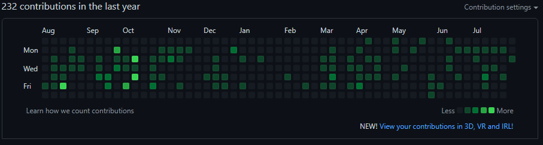
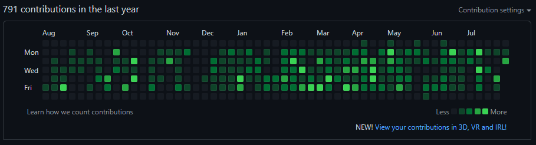

난 꾸준히 공부를 하는 편이라고 생각한다.  
아니 생각했다...

2022년 8월 2일 기준 내 github 기여도이다.  
꾸준하다고 할 수 있을까? 주말은 전멸이라고 할 수 있고 애초에 초록불보다 검정불이 많다.  
**_구차하게 변명을 하자면 회사에서 시간 남을때마다 공부를 했던 커밋은 내 github 계정의 이메일과 회사 PC의 github 환경설정에서의 이메일이 일치하지 않아 반영이 안됐었다. 어쨌든 주말은 전멸이다._**

최근에 아는 개발자가 1일 1커밋에 대한 얘기를 해왔는데 처음에 와닿지 않았다. 근데 꾸준히 한다고 생각했던 내가 github를 보니까 양심에 찔리는거다.

그래서 이번 기회에 얼마나 갈지 모르지만 나도 1일 1커밋을 도전해보려 한다. 스스로 다짐을 위해 이렇게 블로그에 글도 남긴다.

---

ps. 글을 쓰고나서 혹시 몰라서 회사 메일을 내 github 계정에 추가하였더니

초록불이 검정보단 많아졌다. 내가 그래도 회사에서 틈날 때마다 뭔가 하긴 했구나 싶다.
