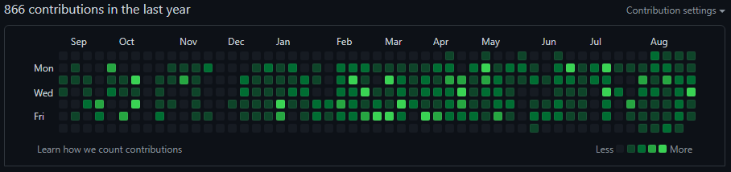

한 달간 꼬박꼬박 1일 1커밋한 후기를 적는다.  
한 달 동안 알고리즘 조금, nextjs 조금, react-native 조금, vue를 공부하였다.
왜 이렇게 중구난방으로 했냐면...

1. 알고리즘  
   최근 프론트엔드로 이직준비를 하느라 코딩테스트를 위해서 공부를 조금 했다.  
   조금 하다가 말아서 이번 달 내로 다시 할 예정이다.

2. nextjs  
   react를 다루는 대부분의 회사가 nextjs를 쓰더라. 그래서 udemy를 통해서 강의를 들어봤는데 엄청 매력적인 프레임워크였다.
   기회가 된다면 nextjs로 이 블로그를 변경하고자 한다.

3. react-native  
   8월 동안 잠깐 react-native를 하는 프로젝트에 투입됐었다. 그래서 부랴부랴 적응하려고 udemy를 통해서 강의를 구매하고 30%가량 듣다가 중도하차 하였다. 그 이유는 아래 4번 문항에서 설명하겠다.

4. vue  
   쭉 react를 공부하다가 왜 vue를 공부하고 있냐면...  
   이직하게 됐다. vue를 하는 회사로.  
   그래서 react-native 강의를 듣다가 바로 그만두고, vue를 공부하고 있다.  
   예전에 인프런에서 캡틴판교님의 vue 강의 5개를 산 게 있었는데 지금 다니고 있는 회사에서 급하게 react를 할 일이 생겨서 구매해놓고 못 보다가... *(난 앞으로 vue 공부할 일 없을 거 같은데 괜히 30만 원주고 샀다고 후회하고 있었다.)* 때마침 vue를 하는 회사에 이직하게 되어 후회를 철회하고 공부하고 있다.

당분간은 vue와 알고리즘 위주의 공부를 하고 있을 거 같다.  

그리고 1일 1커밋을 하는 느낌을 말해보자면 게임을 하는 느낌이 든다.  
난 원래 게임을 되게 좋아한다. 특히 RPG 게임을.  
요즘 RPG 게임들은 대부분 일일 퀘스트(숙제)라는 시스템이 있다. 매일 주어진 퀘스트를 해야지 뒤쳐지지 않고 다른 유저들과 경쟁을 할 수 있다. 지금 1일 1커밋을 하는 느낌이 딱 이 느낌이다. 다른 개발자와 견줄 수 있도록 난 꾸준함을 무기로 나아가는 느낌이다.  

결론은 1일 1커밋은 재미있고 보람차다.  
언제까지 이 스탠스를 유지할 수 있을지 모르겠지만 1일 1커밋을 포기하고 싶지 않다.