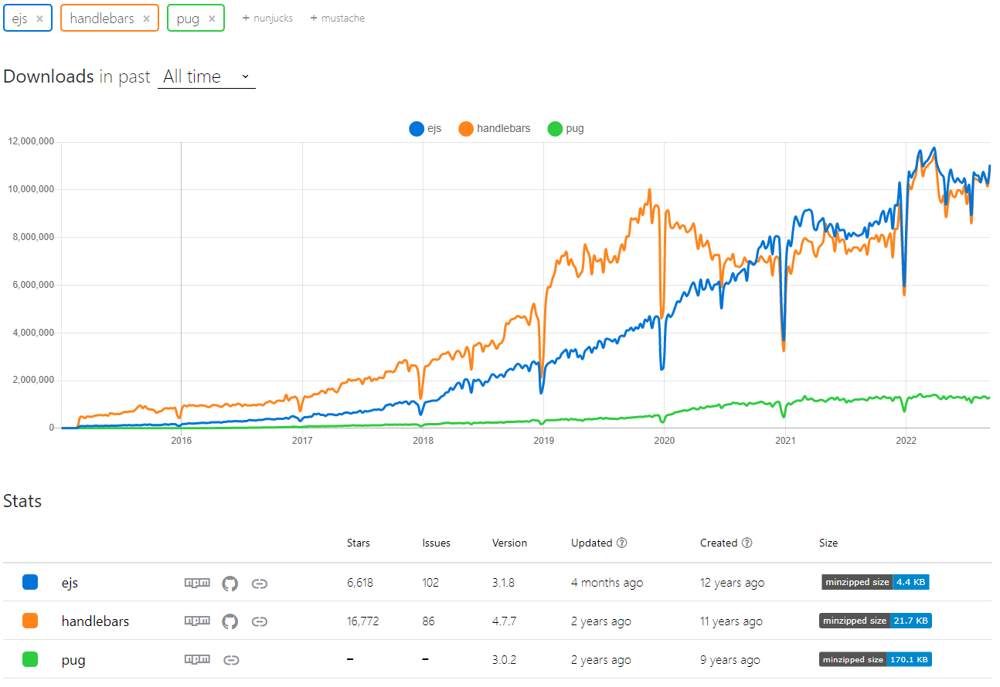

요즘은 실무에서 프론트엔드 프레임워크를 위주로 쓰니 html template engine을 안 쓰는 편이다. _(react, vue에서도 쓰는 경우가 종종 있다.)_  
html template engine은 서버 데이터를 정적 파일(_html_)에 그려서 클라이언트에 전달해주는 역할을 한다.
<a href="https://expressjs.com/en/resources/template-engines.html" target="_blank" rel="noreferrer" title="express template engine list 새창 열기">여러 가지</a>가 있으나 대표적으로 쓰이는 pug(jade), handlebars(hbs), ejs를 정리하고자 한다.

우선 <a href="https://npmtrends.com/ejs-vs-handlebars-vs-pug" target="_blank" rel="noreferrer">npm trends</a>에서 All time 순위를 살펴보면



ejs와 handlebars가 비슷하고 pug는 저 밑에 있다. 왜 그런지 3가지를 비교하며 알아보자.

- ### pug(jade)
  예제부터 살펴보면

  ```
   npm i pug
  ```

  ```js
  /* app.js */
  const express = require('express');
  const app = express();

  app.set('view engine', 'pug');
  ```

  pug는 app.js에서 따로 호출하지 않아도 된다.

  ```pug
   //- layouts/main-layout.pug
   doctype html
   html(lang="ko")
   head
     meta(charset="UTF-8")
     meta(http-equiv="X-UA-Compatible" content="IE=edge")
     meta(name="viewport" content="width=device-width, initial-scale=1.0")
     link(rel="stylesheet" href="/css/main.css")
     block styles
     title #{pageTitle ? pageTitle : 'Page Not Found!'}

   body
     header.main-header
       nav.main-header__nav
       ul.main-header__item-list
         li.main-header__item
           a(href="/", class=(path === '/' && 'active')) Shop
         li.main-header__item
           a(href="/admin/add-product", class=(path === '/admin/add-product' && 'active')) Add Product
     block content
  ```

  ```pug
  //- layouts/index.pug
  extends layouts/main-layout.pug

  block styles
  link(rel="stylesheet" href="/css/product.css")

  block content
  main
    if prods.length > 0
      .grid
      each product in prods
        article.card.product-item
          header.card__header
          h1.product__title #{product.title}
          .card__image
          img(src="https://cdn.pixabay.com/photo/2016/03/31/20/51/book-1296045_960_720.png" alt="A Book")
          .card__content
          h2.product_price $19.99
          p.product_description A very interesting book about so many even more interesting things!
          .card__actions
          button.btn Add to Cart
    else
      h1 No Products
  ```

  보다시피 들여쓰기로 깊이를 체크할 수 있고, 태그도 최대한 생략하게 적는다.  
  용도에 따라 #{}(_문자열로 표시_) 혹은 !{}(_html로 표시_)로 데이터를 가져올 수 있다.  
  extends를 통해 공통 레이아웃을 가져올 수 있고  
  block를 통해 특정 요소를 특정 위치에 넣을 수 있다.  
  또한 간단한 if문, for문을 사용하여 서버에서 데이터를 받아서 뿌릴 수 있다.

  근데 역시나 html과 달리 들여쓰기만으로 구분을 해야 해서 구글링에서 html 복사해오기가 까다롭고, 가독성에 호불호가 갈리는 편이라 다른 template engine보다 사용량이 적다.

- ### handlebars(hbs)

  ```js
  /* app.js */
  const express = require('express');
  const expressHbs = require('express-handlebars');
  const app = express();

  app.engine(
    'hbs',
    expressHbs({
      layoutsDir: 'views/layouts/',
      defaultLayout: 'main-layout',
      extname: 'hbs',
    })
  );
  app.set('view engine', 'hbs');
  ```

  pug와 달리 app.js에서 호출해줘야 하고, route에서 세세한 설정이 필요하다.

  ```js
  /* routes.js */
  const express = require('express');
  const adminData = require('./admin');

  const router = express.Router();

  router.get('/', (req, res, next) => {
    const products = adminData.products;

    res.render('shop', {
      prods: products,
      pageTitle: 'Shop',
      path: '/',
      hasProducts: products.length > 0,
      activeShop: true,
      productCSS: true,
    });
  });

  module.exports = router;
  ```

  ```hbs
   {{!-- layouts/main-layout.hbs --}}
   <html lang='ko'>
     <head>
       <meta charset='UTF-8' />
       <meta name='viewport' content='width=device-width, initial-scale=1.0' />
       <meta http-equiv='X-UA-Compatible' content='ie=edge' />
       <title>{{pageTitle}}</title>
       <link rel='stylesheet' href='/css/main.css' />
       {{#if formCSS}}
         <link rel='stylesheet' href='/css/forms.css' />
       {{/if}}
       {{#if productCSS}}
         <link rel='stylesheet' href='/css/product.css' />
       {{/if}}
     </head>
     <body>
       <header class='main-header'>
         <nav class='main-header__nav'>
           <ul class='main-header__item-list'>
             <li class='main-header__item'><a class="{{#if activeShop}}active{{/if}}" href='/'>Shop</a></li>
             <li class='main-header__item'>
               <a class="{{#if activeAddProduct}}active{{/if}}" href='/admin/add-product'>Add Product</a>
             </li>
           </ul>
         </nav>
       </header>
       {{{body}}}
     </body>
   </html>
  ```

  ```hbs
  {{! views/index.hbs }}
  <main>
    {{#if hasProducts}}
      <div class='grid'>
        {{#each prods}}
          <article class='card product-item'>
            <header class='card__header'>
              <h1 class='product__title'>{{this.title}}</h1>
            </header>
            <div class='card__image'>
              
            </div>
            <div class='card__content'>
              <h2 class='product__price'>$19.99</h2>
              <p class='product__description'>A very interesting book about so
                many even more interesting things!</p>
            </div>
            <div class='card__actions'>
              <button class='btn'>Add to Cart</button>
            </div>
          </article>
        {{/each}}
      </div>
    {{else}}
      <h1>No Products Found!</h1>
    {{/if}}
  </main>
  ```

  pug와 달리 html 구문을 그대로 쓸 수 있으며 {{}} 콧수염 모양인 중괄호 2개로 데이터를 가져올 수 있다.
  hbs에서의 if문은 true, false 여부만 판단해준다. 그래서 script에서 helper함수를 생성한다.  
  공통 layout을 서버에서 처리하게 된다.  
  hbs는 서버에서 세세한 설정을 하여 html에서 작성하는 걸 최소화 하였다.

- ### ejs

  ```js
  /* app.js */
  const express = require('express');
  const app = express();

  app.set('view engine', 'ejs');
  ```

  ```ejs
  <!-- head.ejs -->
  <!DOCTYPE html>
  <html lang="ko">

  <head>
    <meta charset="UTF-8" />
    <meta name="viewport" content="width=device-width, initial-scale=1.0" />
    <meta http-equiv="X-UA-Compatible" content="ie=edge" />
    <title><%= pageTitle %></title>
    <link rel="stylesheet" href="/css/main.css" />
  ```

  ```ejs
  <!-- navigation.ejs -->
  <header class="main-header">
  <nav class="main-header__nav">
    <ul class="main-header__item-list">
      <li class="main-header__item"><a href="/" class="<%= path === '/' && 'active' %>">Shop</a></li>
      <li class="main-header__item">
        <a href="/admin/add-product" class="<%= path === '/admin/add-product' && 'active' %>">Add Product</a>
      </li>
    </ul>
  </nav>
  </header>
  ```

  ```ejs
  <!-- end.ejs -->
  <script src="common.js"></script>
  </body>

  </html>
  ```

  ```ejs
  <%- include('./includes/head.ejs') %>
  <link rel="stylesheet" href="/css/product.css">
  </head>

  <body>
    <%- include('./includes/navigation.ejs')%>

    <main>
      <% if (prods.length > 0) { %>
      <div class="grid">
        <% prods.map(item => { %>
        <article class="card product-item">
          <header class="card__header">
            <h1 class="product__title"><%= item.title %></h1>
          </header>
          <div class="card__image">
            
          </div>
          <div class="card__content">
            <h2 class="product__price">$19.99</h2>
            <p class="product__description">
              A very interesting book about so many even more interesting
              things!
            </p>
          </div>
          <div class="card__actions">
            <button class="btn">Add to Cart</button>
          </div>
        </article>
        <% }) %>
      </div>
      <% } else { %>
      <h1>No Products Found!</h1>
      <% } %>
    </main>

    <!-- body, html의 닫는 태그를 end.ejs에 넣은 이유는 -->
    <!-- end.ejs에 공통 script를 넣고 이 부분에 해당 페이지에 적합한 script를 작성하기 위함. -->
    <%- include('./includes/end.ejs')%>
  ```

  ejs는  
   <%= %>로 데이터를 가져오고,  
   <%- %>로 공통 레이아웃을 가져오고,  
   <% %>로 if, for문같은 흐름을 제어한다.  
   이처럼 다른 template engine에 비하여 러닝 커브가 있는 편이나, javascript를 그대로 사용할 수 있는 장점이 있다.  
   하지만 다른 template engine과 다르게 vscode가 <% %>문을 강조를 안 해주기에 가독성이 떨어질 수 있으나, 확장 프로그램에 <a href="https://marketplace.visualstudio.com/items?itemName=DigitalBrainstem.javascript-ejs-support" target="blank" rel="noreferrer">EJS language support</a>를 통하여 해결할 수 있다.

간단하게 ejs, hbs, pug를 알아보았다.  
개인적으로 pug는 기존 html과는 다른 형태라 논외로 보고, ejs와 hbs중 javascript를 자유롭게 쓸 수 있는 ejs를 선호한다.
