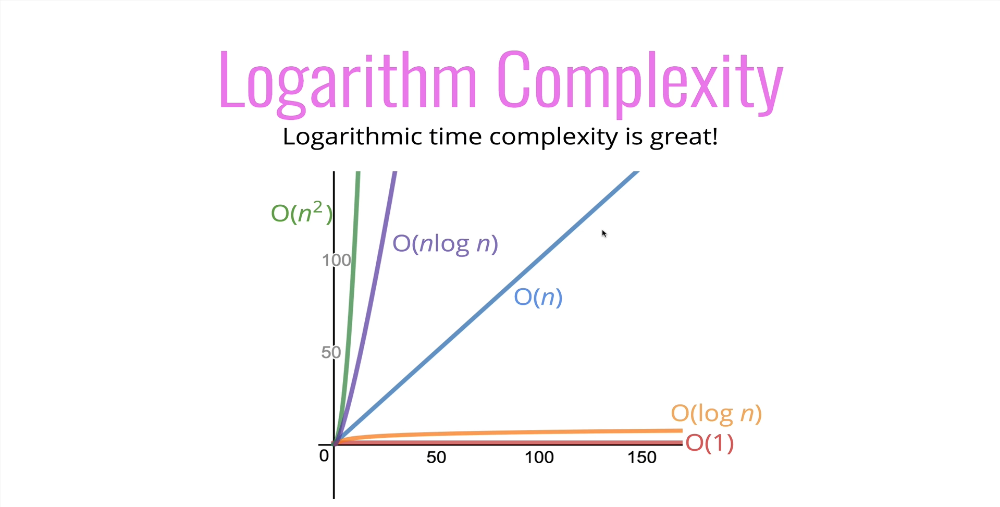
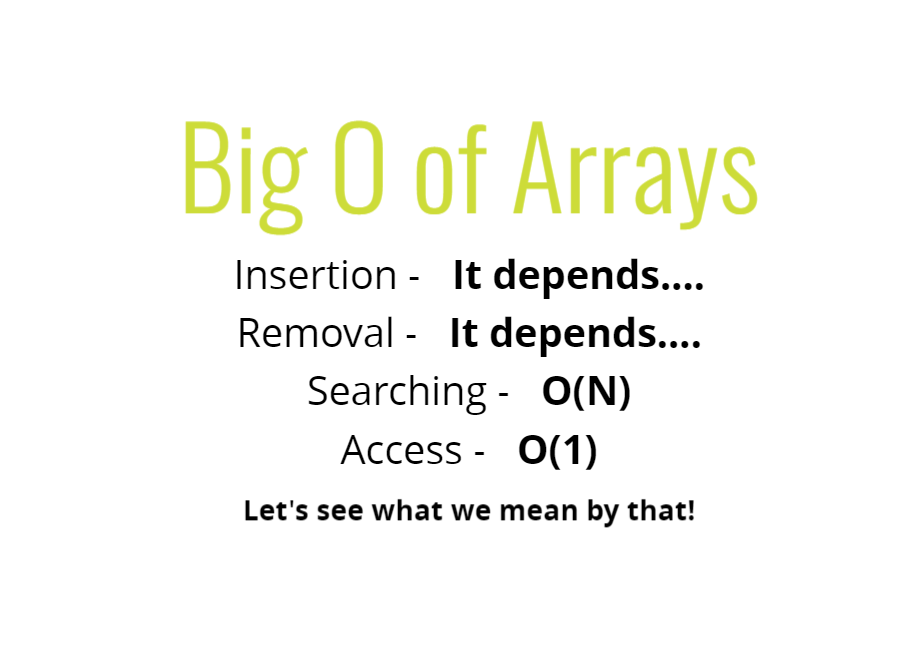
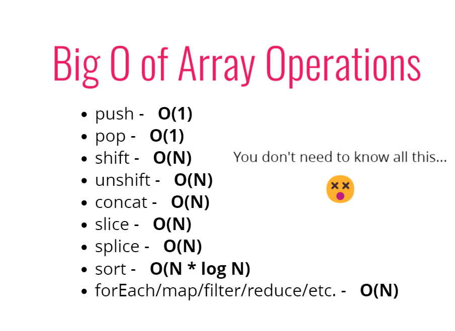
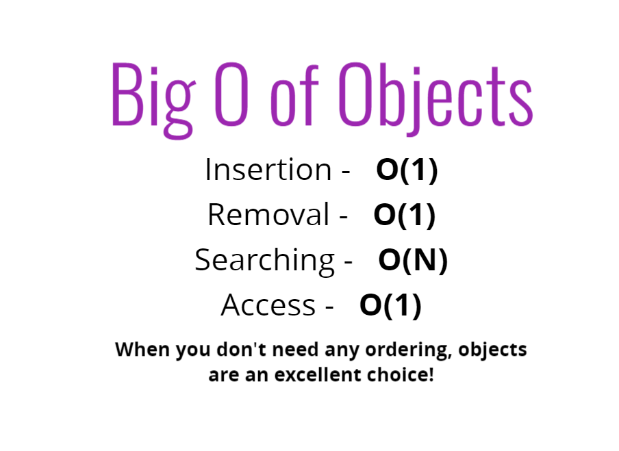
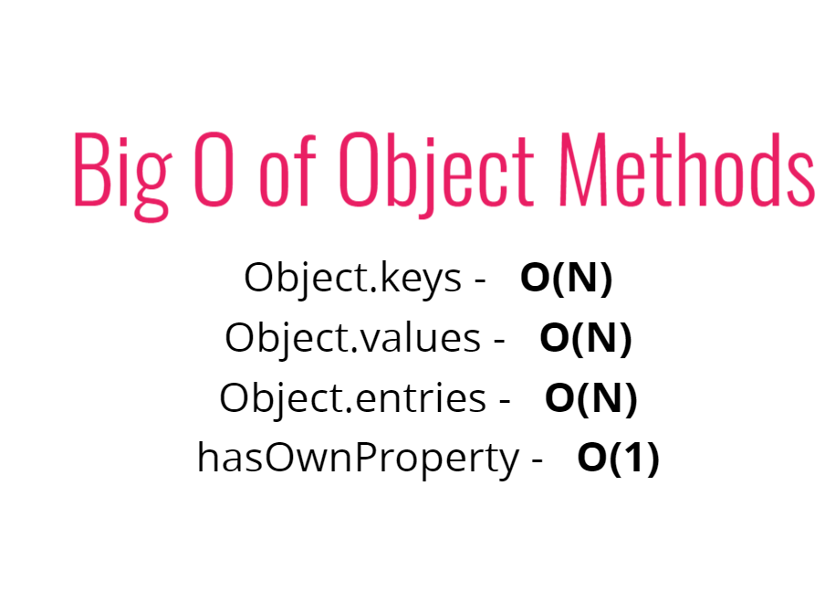

나는 알고리즘을 많이 짜는 직군은 아니지만 그렇다고 아예 안쓰는 직군도 아니다. 그래서 빅오표기법에 대해 찾아봤고 Udemy강의 중 Colt Steele의 <a href="https://www.udemy.com/course/best-javascript-data-structures/" target="_blank" rel="noreferrer">Javascript 알고리즘 &amp; 자료구조 마스터클래스</a>를 듣고 프론트엔드 개발자로서 실무에 꽤 유용한 부분이 있어서 따로 정리한다.

빅오표기법에 대한 개념이나 이론은 구글링하면 수도 없이 많이 나오기 때문에 이 글엔 적지 않을 것이다.
빅오표기법에서는 시간복잡도와 공간복잡도로 나뉘는데 실무에서는 공간복잡도를 거의 고려하지 않는 것 같다.(나만 고려하지 않는 거일 수도 있다.)

일단 로그복잡도를 보면

x축은 데이터 입력량이고,  
y축은 시간 경과를 나타낸다. 기울기가 가파를수록 내가 코드를 저세상으로 짰다는 뜻이다.

그럼 이제 의문은 내 코드가 어떤 로그복잡도를 가지느냐인데, 대부분의 로그복잡도를 결정하는 건 Array나 Object를 다루는 과정에서 결정되기에 아래 내용을 통해 알아보자.

배열에서의 접근은 O(1), 검색은 O(n), 삽입과 삭제는 배열의 끝에서 일어나지 않는 이상(_삽입, 삭제되면 그 뒤의 index가 재배열 되기 때문_) O(n)이다.(_배열의 끝에선 O(1)_)

배열에서 우리가 대표적으로 쓰는 메소드들의 빅오다. 우리가 많이 쓰는 반복문은 전부 O(n)이고 배열을 합치거나 자르는 경우도 O(n)이다.  
참고로 이중반복문은 O(n^2)이다. 삼중반복문은 O(n^3)이다. 이렇게 늘어나기에 반복문을 중복해서 쓰는 건 어쩔 수 없는 경우가 아니라면 지양해야 한다.  
위 이미지를 보면 배열을 다룰 때 조금 더 효율적인 방법이 있다는 것을 알 수 있다. 예를 들면 push와 pop이 shift, unshift보다 효율적이니까 실무에서 잘 응용할 수 있을 것이다.

오브젝트는 배열과 달리 순서가 중요하지 않기 때문에 탐색을 제외하면 모두 빠르다. 탐색은 key와 value를 모두 찾아야 하므로 O(n)이다.

오브젝트에서 대표적으로 쓰는 메소드들의 빅오다.
이미지에는 따로 안 적혀있는데 entries는 key-values를 모두 가져오기 때문에 다른 object 메소드들보다 느리다고 한다.

위의 내용을 기억하고 로직을 짜도록 하자.
