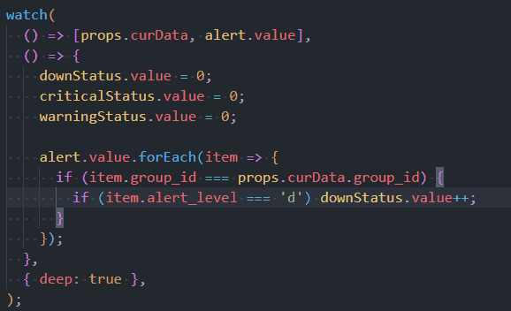

전 직장 개발자분하고 얘기를 나누던 중에 <a href="https://github.com/features/copilot/" target="_blank" rel="noreferrer" title="copilot 공식 홈페이지 새창 열기">copilot</a>에 대한 찬사를 듣고 나도 3개월 전부터 실무에서 써보았다. 처음 2개월은 무료로 사용해보고, 꽤나 유용해서 1년치(_100달러_)를 끊었다.  
아래 내가 느낀 2가지 장점과 문제점 그리고 내 종합적인 생각을 적어본다.

### 장점

1. 주석, 함수 이름에 담긴 의미를 파악하여 코드를 자동 완성  
   
   위 코드는 친구가 풀어보라고 준 수학문제인데 copilot을 통해서 코드를 작성해봤는데 이처럼 간단한 코드는 잘 작성되었다.  
   copilot을 소개하는 글을 보면 주석, 함수 이름에 담긴 의미를 파악하여 코드를 자동 완성하는 건데, 간단한 로직 정도는 내가 일일이 칠 필요 없이 구현을 잘하긴 하는데 조금이라도 복잡해지면 코드가 이상하게 작성되는 경우가 많았다. _(변수만 무한 선언하더라)_

2. 앞 뒤 문맥, 다른 파일의 코드를 참고하여 코드를 자동 완성  
   
   위 코드는 내가 실무에서 작성한 코드인데, 내가 작성한 코드를 보고 앞의 문맥을 파악하여 눈치껏 코드를 완성 시켜줬다. 이미지엔 담기지 않았지만 실제로 사용해보면 다른 파일에서 작성했던 스타일을 기억하고 새 파일을 작성할 때도 그 스타일에 맞게 작성해준다.

### 문제점

1. 저작권 문제  
   <a href="https://www.bleepingcomputer.com/news/security/microsoft-sued-for-open-source-piracy-through-github-copilot/" target="_blank" rel="noreferrer" title="Microsoft, GitHub Copilot을 통한 오픈소스 불법복제 소송 뉴스 새창 열기">Microsoft, GitHub Copilot을 통한 오픈소스 불법복제 소송</a>이란 기사다.  
   실제로 copilot이 발표 됐을때 많은 사람들이 우려했던 부분이고, 실제로 고소를 당했다. 아마 이부분은 라이센스를 구분하여 작성하게끔 하지 않을까 싶다.

2. 코드가 이상하게 작성됨  
   위에서도 언급했지만, 코드가 개발자 의도대로 작성되지 않는 경우가 있다.  
   이 부분은 애초에 개발자가 copilot을 그대로 갖다 쓰는 건 아직 기술적으로 무리고, copilot이 제안하는 코드를 보고 개발자가 수정하는 방식으로 사용해야 한다.

---

우스갯소리로 copilot같은 AI 기반의 도구들이 개발자의 역할을 대체할 수 있다는 글을 보았다. 실제로 현업에 있는 내 생각엔 개발자의 역할을 대체하기엔 어렵다고 생각한다. 독립적인 로직은 copilot이 작성할 수 있다고 쳐도, 그 로직을 어떻게 사용할지, 어떤 방식으로 구현할지는 개발자가 결정해야 한다. 그리고 이런 결정을 내리는 과정은 개발자의 노하우가 필수불가결하다. _(이마저도 가능케 한다면 그땐 정말 알파고 바둑 두듯이 대신 쳐주기만 하는 사람만 있으면 될지도...)_

현재 편의를 위해 사용하는 도구들(_emmet, eslint, prettier, webstorm, ..._)과 더불어 copilot도 개발자의 편의를 위해 많이 사용되지 않을까 생각한다.  
아무튼, 비록 유료지만 타자를 덜 쳐도 되는 점, 구글링을 덜 해도 되는 점의 장점이 있어서 개발자들에게 추천해주고 싶다. 회사에서도 지원해주면 좋겠는데 아직 copilot이 크롤링하는 과정에서 라이센스 관련 문제가 있어서 그건 힘들지 않을까 싶다.
