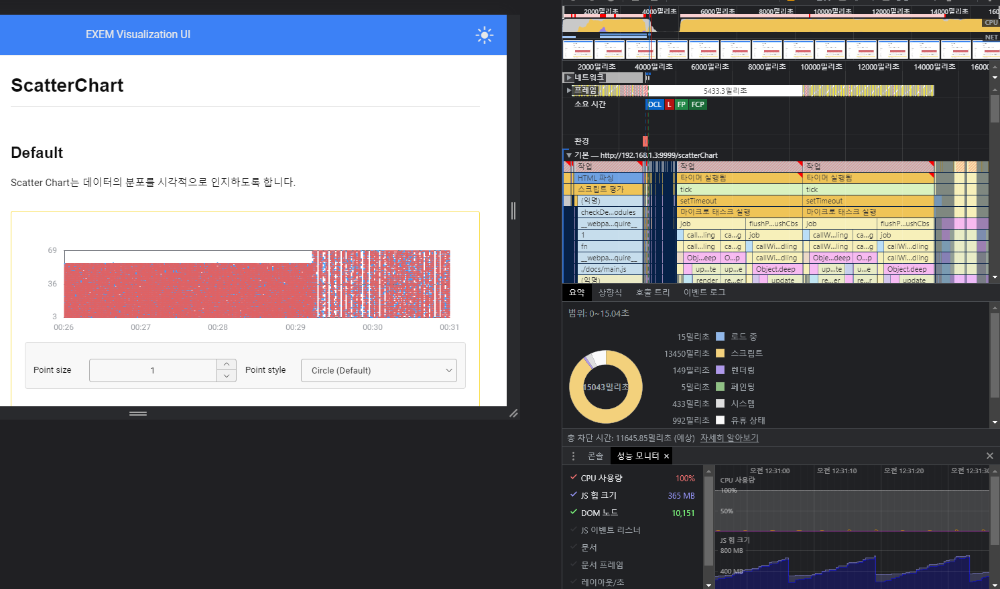
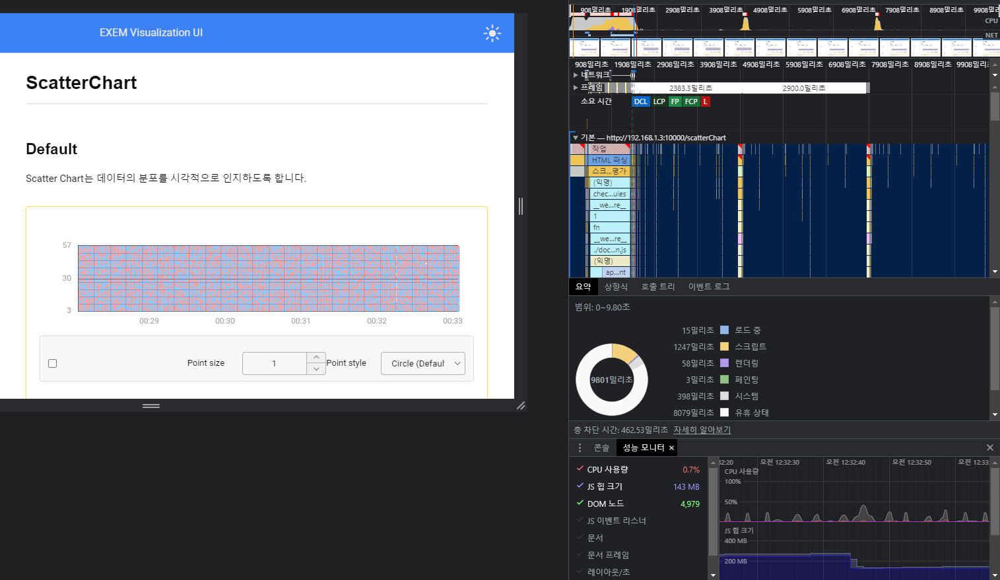
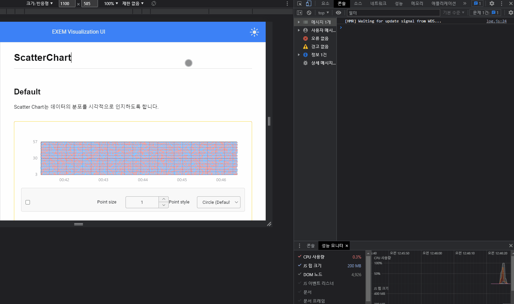

100만 개 이상의 데이터를 가진 배열을 주기적으로 갱신할 때, 어떻게 해야 할까?
3주나 걸린 고민의 흔적을 남겨본다.

문제의 시작은 이렇다.

1. Vue를 기반으로 한 사내 라이브러리 <a href="https://github.com/ex-em/EVUI" target="_blank" rel="noreferrer" title="EVUI github 새창 열기">EVUI</a>의 scatter chart를 활용하여 3초마다 갱신되는 데이터를 표현하는 화면을 만들었다.
2. 근데 듣기로는 데이터가 100만 개가 들어오는 경우가 있다고 하여, 테스트를 해보았는데 100만 개는 페이지를 제대로 로딩조차 못하고, 1/10인 10만개를 넣어도 버벅대는 수준이었다.
   
   CPU 사용량이 100% 아래로 떨어지지도 않고 차트를 그리는데 모든 리소스를 가지고 가서 다른 작업을 할 수도 없는 상황이었다.

### &middot; 문제 원인 파악 및 해결

1. 다른 유료 라이브러리를 확인해보니 배열을 2차 배열로 생성하여 갱신할 때 없애야 할 데이터를 []로 초기화 시키는 방식을 사용하였다. 이게 무슨 말이냐면,

   ```js
   // 1차 배열
   const data = [{x: 00:00, y: 10}, {x: 00:00, y: 15}, {x: 00:01, y: 20}, {x: 00:02, y: 30}, ...];
   ```

   1차 배열에서는 filter, slice, splice같이 배열을 재생성하는 방식을 사용해야 한다. 이 말은 곧 배열을 재생성하는 과정에서 메모리를 많이 사용한다는 것이다.  
    하지만, 2차 배열에서는

   ```js
   const data = [
   [{x: 00:00, y: 10}, {x: 00:00, y: 15}],
   [{x: 00:01, y: 20}], [{x: 00:02, y: 30}],
   ...];
   ```

   추가적인 로직을 사용하여 _(ex: startIndex, endIndex로 3초가 지난 시점의 데이터 위치를 파악)_ 지난 시점의 데이터를 []로 초기화 시키면 된다. 그리고 추가로 들어온 데이터는 해당 index에 맞게 데이터를 추가하면 된다.

2. 라이브러리 차트 코어 안에 배열을 재생성하는 구간이 많았다. _(lodash의 defaultDeep, cloneDeep)_ 이렇게 되면 1번과 마찬가지로 배열을 재생성하여 메모리를 많이 사용하게 된다. 그래서 모든 재생성 과정을 없애고, 배열 주소 참조를 활용하여 메모리 사용량을 줄였다.

3. Vue의 ref, reactive는 <a href="https://developer.mozilla.org/ko/docs/Web/JavaScript/Reference/Global_Objects/Proxy" target="_blank" rel="noreferrer" title="Proxy MDN 새창 열기">Proxy</a>를 활용하여 반응성 데이터를 만든다. Proxy의 특징 중에, 원본 객체에 대한 특정 연산이 발생할 때마다 가로채고 변경하게 되는데, 프록시 객체에 대한 모든 연산은 프록시 핸들러 함수를 거쳐야 하므로, 이 과정에서 추가적인 오버헤드가 발생하게 된다. 그래서 chart를 draw 하는 과정에서 반응성 데이터(_Proxy_)를 for문을 돌리다 보니 매우 느려졌다.  
   그래서 <a href="https://ko.vuejs.org/api/reactivity-advanced.html#toraw" target="_blank" rel="noreferrer" title="toRaw document 새창 열기">toRaw</a>로 반응성 데이터를 일반화 시키고, 영구 참조를 없애기 위해 로직도 맞게 수정하였다.

이 문제들을 발견하고 해결하기까지 canvas를 offscreenCanvas를 써야 하나? Web Worker를 써야 하나? 기존에 점을 그릴 때 arc를 썼는데 속도적인 측면에서 좀 더 나은 rect로 바꾸기도 해보고 여러 트러블 슈팅이 있었다. 머리 빠져가는 스트레스를 받아 가며 개선하고 나니 오랜만에 느껴보는 개발의 쾌감이었다.

아래는 문제가 해결되고 난 후의 사진이다.



<a href="complete.gif" target="_blank"></a>

---

### 2023.05.24 내용 추가

Vue에서 대량의 데이터를 처리할 때 쓰면 좋은 API가 있다. <a href="https://ko.vuejs.org/guide/best-practices/performance.html#reduce-reactivity-overhead-for-large-immutable-structures" target="_blank" rel="noreferrer" title="Vue 반응성 오버헤드 감소 문서 새창 열기">Vue 반응성 오버헤드 감소 문서</a> 이 글을 읽어보면 내가 쓴 글과 같은 고민을 하는 사람에게 도움이 될거라 본다. 여러 테스트를 해본 결과 Vue에서 대량의 데이터를 가진 배열을 props로 전달만 해도 엄청난 성능 저하가 왔다. _(성능 검사를 하면 "HTML 파싱" 이 부분이 제일 많이 차지한다.)_ 이럴때 shallowRef / shallowReactive를 활용하면 좋다. 단, 저 링크에도 설명돼있지만 shallow를 사용하면 아래 처럼 shallow를 선언한 루트에서만 변경이 이뤄져야 반응성이 적용된다.

```js
const shallowArray = shallowRef([
  /* 깊은 객체의 큰 목록 */
]);

// 반응성 업데이트가 되지 않음.
shallowArray.value.push(newObject);
// 아래처럼 value를 직접 변경해야 반응성이 적용된다.
shallowArray.value = [...shallowArr.value, newObject];

// 반응성 업데이트가 되지 않음.
shallowArray.value[0].foo = 1;
// 아래처럼 value를 직접 변경해야 반응성이 적용된다.
shallowArray.value = [
  {
    ...shallowArray.value[0],
    foo: 1,
  },
  ...shallowArray.value.slice(1),
];
```
